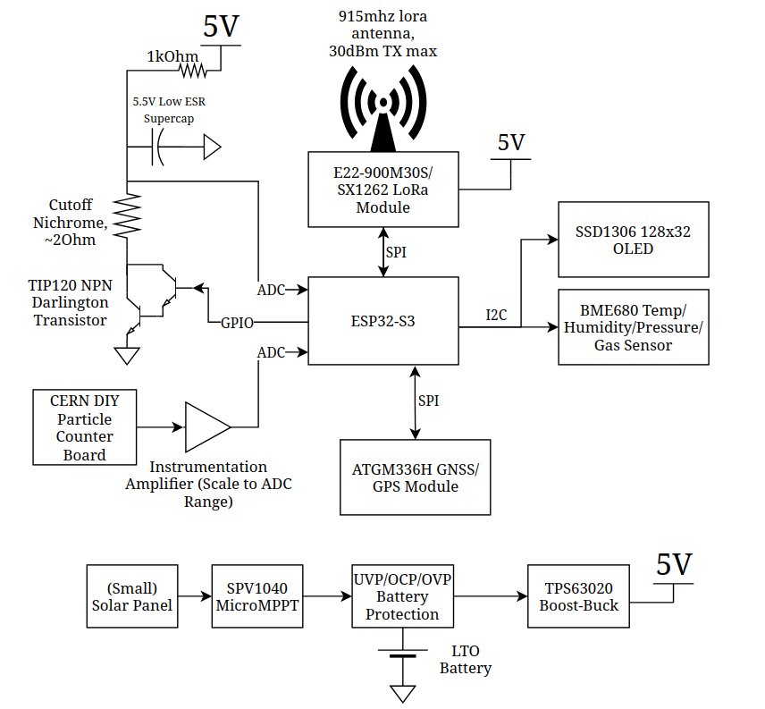

# SpaceBridge HAB PCB

High Altitude Balloon (HAB) PCB Tracker with cutdown mechanism, GPS, environmental monitoring, LoRa telemetry and particle detection capabilities.

Created by Lucy Moglia <eigenlucy@proton.me>

## Table of Contents
- [Overview](#overview)
- [Project Structure](#project-structure)
- [Block Diagram](#block-diagram)
- [Features](#features)
- [Getting Started](#getting-started)
  - [Building the Project](#building-the-project)
  - [Installation](#installation)
    - [Linux Installation](#linux-installation)
    - [Mac Installation](#mac-installation)
    - [Visual Studio Code/Cursor Extension](#visual-studio-codecursor-extension-install)

## Overview

The SpaceBridge HAB PCB is a comprehensive tracking and instrumentation system for high altitude balloon experiments. It integrates multiple subsystems including power management, telemetry, GPS tracking, environmental monitoring, and a particle counter based on CERN open source hardware.

## Project Structure

| Module | Source File | PCB Layout | Description |
|:------:|:----------:|:----------:|:------------|
| Mainboard | [`mainboard.ato`](./mainboard.ato) | [`layouts/default/default.kicad_pcb`](./layouts/default/default.kicad_pcb) | Final PCB incorporating all submodules |
| MicroMPPT | [`micromppt/elec/src/micromppt.ato`](./micromppt/elec/src/micromppt.ato) | [`micromppt/elec/layout/default/micromppt.kicad_pcb`](./micromppt/elec/layout/default/micromppt.kicad_pcb) | 5W MPPT battery charger with embedded set point adjustment algorithm |
| Particle Counter | [`particle_counter.ato`](./particle_counter.ato) | [`layouts/particle-counter/particle-counter.kicad_pcb`](./layouts/particle-counter/particle-counter.kicad_pcb) | Alpha particle detector based on CERN open source hardware kit |
| Cutoff Mechanism | [`cutoff.ato`](./cutoff.ato) | [`layouts/cutoff/cutoff.kicad_pcb`](./layouts/cutoff/cutoff.kicad_pcb) | Balloon cutoff circuit using lithium hybrid supercapacitor discharging through nichrome wire |
| BQ24045DSQR BMS | [`bq24045dsqr/elec/src/bq24045dsqr.ato`](./bq24045dsqr/elec/src/bq24045dsqr.ato) | [`bq24045dsqr/elec/layout/default/bq24045dsqr.kicad_pcb`](./bq24045dsqr/elec/layout/default/bq24045dsqr.kicad_pcb) | 5V 1A single cell LiPo/Li-ion charger + BMS |
| TPS63020DSJR | `~/.ato/modules/tps63020dsjr/elec/src/tps63020dsjr.ato` | `~/.ato/modules/tps63020dsjr/elec/layout/tps63020dsjr.kicad_pcb` | 1.8V-5.5V In/Out 4A boost-buck converter (5V from Vbat) |

## Block Diagram



## Features

- **Power Management**: Solar charging with MPPT, battery protection and 5V regulation
- **Communication**: 915MHz LoRa radio for long-range telemetry (30dBm TX max)
- **Positioning**: ATGM336H GNSS/GPS module
- **Sensors**: 
  - BME680 temperature/humidity/pressure/gas sensor
  - CERN DIY particle counter for radiation detection
- **Display**: SSD1306 128x32 OLED screen
- **Control**: ESP32-S3 microcontroller
- **Recovery**: Nichrome wire cutdown mechanism for payload separation

## Getting Started

### Building the Project

1. **Clone the required submodules**
   ```
   git submodule update --init --recursive
   ```

2. **Build the project to select components based on JLCPCB availability**
   ```
   ato build -t all
   ```

3. **Complete/review the layout with KiCad Standalone PCB editor**

4. **Gerbers/PCBA files are generated through an Actions run on a commit**

### Installation

#### Linux Installation
1. Install [uv](https://github.com/astral-sh/uv)
2. Install KiCad with your preferred package manager (apt for Debian, pacman for Arch, etc.)
3. Install atopile as a tool with uv (Python 3.13.2 recommended):
   ```
   uv tool install atopile
   ```

   **Alternative installation method:**
   1. Clone the main [atopile repo](https://github.com/atopile/atopile)
   2. Remove the uv lock file:
      ```
      rm uv.lock
      ```
   3. Sync repo to dev release:
      ```
      uv sync --dev
      ```
   4. Compile atopile:
      ```
      uv build
      ```
   5. Install the binary:
      ```
      uv tool install atopile-0.3.XX-cp313-cp313-linux-_x86_64.whl
      ```
   6. Add the uv tools binary directory to your PATH (command depends on your shell, e.g., with fish):
      ```
      fish_add_path /home/user/.local/share/uv/tools/atopile/
      ```

4. Check your version:
   ```
   ato --version
   ```

5. Configure the atopile plugin:
   ```
   ato configure
   ```

#### Mac Installation
1. Install [Homebrew](https://brew.sh/)
2. Install [KiCad 9](https://formulae.brew.sh/cask/kicad):
   ```
   brew install --cask kicad
   ```
3. Install atopile with Homebrew:
   ```
   brew install atopile/tap/atopile
   ```
4. Configure the atopile plugin:
   ```
   ato configure
   ```

#### Visual Studio Code/Cursor Extension Install
Install the [atopile extension](https://marketplace.visualstudio.com/items?itemName=atopile.atopile) into Cursor or Visual Studio Code.
